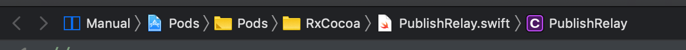
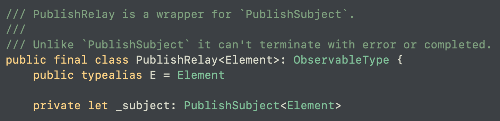

# Relay

Relay는 이제껏 배운 Subject와 달리 RxSwift에 있는 것이 아니라, RxCocoa에 있다.



즉 뭔가 UI와 관련있을 것 같지 않은가?
맞ㄷㅏ

일단 Relay의 종류에는 2가지가 있는데, ```PublishRelay```와 ```BehaviorRelay```가 있다.


## PublishRelay / BehaviorRelay

PublishRelay는 우리가 Subject에서 배웠던 ```PublishSubject```와 이름이 비슷하다.
맞다! PublishRelay는 PublishSubject와 굉장히 유사하다.
소스코드를 보자.



위 코드를 보면 알 수 있듯이, 

**PublishRelay is a wrapper for `PublishSubject`.**
PublishRelay는 PublishSubject의 래퍼클래스라고 한다.

**Unlike `PublishSubject` it can't terminate with error or completed.**
PublishSubject와 다르게 error 또는 completed로 인해 종료되지 않는다.

이것이 PublishRelay가 가지고 있는 단하나의특징이다. \
BehaviorRelay도 완전히 비슷하다.

PublishRelay처럼 RxCocoa에 구현되어있으며, `BehaviorSuject`의 래퍼클래스이며 역시나 **error 또는 completed로 인해 종료되지 않는다.**

그리고 다 똑같다!
PublishRelay는 PublishSubject가 가지고 있었던 특성을 그대로 가진다. BehaviorRelay도 마찬가지고.

그럼 우리가 여기서 드는 궁금증은 단 하나다.
**error 또는 completed로 인해 종료되지 않는다는게 무엇을 의미하는가?**


