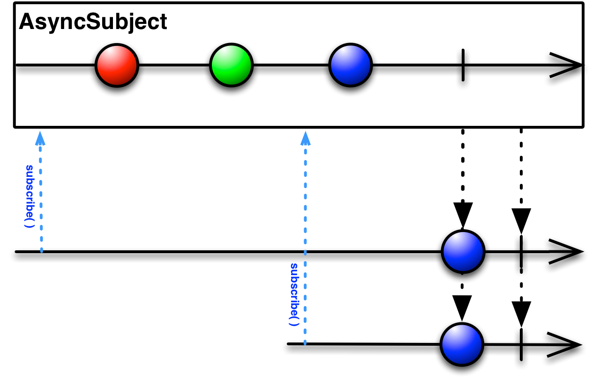

# Subject

앞서, ```observable```을 배웠다.
오늘은 ```subject```를 배워보겠다. [ReactiveX](http://reactivex.io/documentation/subject.html)의 subject설명을 보면, 복잡한데, 한마디로
**subscriber의 속성과 Observable의 속성을 둘 다 가지고 있다는 것이다**

Observable처럼 데이터를 발행할 수도 있고(onNext), subscriber처럼 발행된 데이터를 바로 처리할수도 있다. 

cold observable(구독할때까지 발행을 기다리는 경우)을 hot observable(구독의 여부와 상관없이 데이터를 발행한다)로 바꿀 수 있는것이 ```Subject```다.
> cold observable은 구독자가 구독하는 순간, 분비된 데이터를 처음부터 발행한다. 그에 반해 hot observable은 구독한 시점부터 observable에서 발행한 데이터를 받는다.

cold > hot의 개념이 잘 이해가 안갈 수 있다. 

그냥 내가 원하는 데이터를 구독자의 여부와 상관없이 발행하고 싶다! 라고 하면 ```Subject```를 사용하면 된다.

Subject에는 4가지 종류가 있다.
```AsyncSubject```,  ```BehaviorSubject```,  ```PublishSubject```,  ```ReplaySubject```가 있다.

하나씩 차근차근히 보도록 하자.

## AsyncSubject
`AsyncSubject`는 소스 Observable로부터 배출된 마지막 값(만)을 배출하고 소스 Observable의 동작이 완료된 후에야 동작한다.\



`AsyncSubject`에 보면 되는건 그냥 **마지막 데이터**다. 
내가 마지막 데이터에만 관심이 있다면 AsyncSubject를 사용하면 된다.

위 마블 다이어그램을 확인해보면, 처음 subscribe했을 때, 아무 데이터를 받지 않은 것을 볼 수 있다. 왜냐? AsyncSubject가 발행한 **마지막 데이터**가 없기때문이다. 
AsyncSubject가 그 뒤로 데이터를 발행했다고 해서 subscriber에게 데이터를 주는게 아니다. 시간이 지나고 subscribe하면, 왠지 **지금까지** AsyncSubject에 발행된 마지막 데이터가 초록색 원이니까 초록색 원을 줄 것 같지만, 받는건 파란색 원이다. 
여기서 알 수 있는 사실은 AsyncSubject가 complete되고 난 후!!!에. 그러니까 AsyncSubject가 complete된 시점에서의 마지막 데이터를 발행하는 것이다. 
동시에 처음에 subscribe했던 구독자에게도 ㄷㅔ이터가 발행된다.
한마디로, AsyncSubject가 onComplete되는 순간 구독자들에게 데이터를 주는 것이다. 

~~~swift 
let asyncSubject = AsyncSubject<String>()

asyncSubject.subscribe(onNext: { (string) in
            print("subscriber 1 : \(string)")
        }, onCompleted: {
            print("subscriber 1 on completed")
})
asyncSubject.subscribe(onNext: { (string) in
            print("subscriber 2 : \(string)")
        }, onCompleted: {
            print("subscriber 2 on completed")
})
~~~
자 위와같은 코드가 있다고 생각해보자.
asyncSubject라는 ```AsyncSubject```인스턴스를 만들고 걔를 subscribe를 2번했다. 2명의 구독자가 생긴것이다.

하지만 콘솔에는 아무것도 출력이 되지 않는다. 
지금까지는 당연하다. asyncSubject가 아무 데이터를 발행하지 않았기 때문이다.
발행해볼까?

~~~swift 
asyncSubject.onNext("zedd")
asyncSubject.onNext("marshmello")
~~~

자 데이터를 발행했지만, 여전히 콘솔에는 아무것도 찍히지 않는다.
왜냐? 위에서 AsyncSubject의 정의를 봤듯이, AsyncSubject가 onComplete되지 않는 이상 데이터는 subscriber들에게 오지 않는다.
asyncSubject를 onComplete시켜보자.

~~~swift 
asyncSubject.onCompleted()
~~~

자, 이제 콘솔에 뭔가가 찍힐것이다. 

**subscriber 1 : marshmello\
subscriber 2 : marshmello\
subscriber 1 on completed\
subscriber 2 on completed**

자, zedd는 출력이 안되고 marshmello만 출력이 된 것을 볼 수 있다. 그리고 subscribe들도 같이 종료가 된다.
마블다이어그램을 같이 보면서 예제를 보면 더욱 더 이해가 잘 갈것이다.

그럼 한가지 상황을 더 가정해보자.
~~~swift 
asyncSubject.onCompleted()
~~~
를 하고 나서, asyncSubject가 데이터를 하나 더 발행하고, subscriber가 하나 더 생긴다면 어떻게 될까?

코드로 살펴보자.
~~~swift
asyncSubject.onCompleted()
asyncSubject.onNext("kygo")
        
asyncSubject.subscribe(onNext: { (string) in
            print("subscriber 3 : \(string)")
        }, onCompleted: {
            print("subscriber 3 on completed")
})
~~~

asyncSubject가 onCompleted를 호출하고 나서, 데이터를 한번 더 발행하고 subscribe도 한번 더 해봤다.
결과는?

// 퀴즈


## BehavioirSubject

옵저버가 BehaviorSubject를 구독하기 시작하면, 옵저버는 소스 Observable이 가장 최근에 발행한 항목(또는 아직 아무 값도 발행되지 않았다면 맨 처음 값이나 기본 값)의 발행을 시작하며 그 이후 소스 Observable(들)에 의해 발행된 항목들을 계속 발행한다.


```BehaviorSubject```에서 주요 하게 봐야 할 부분은 **초기값**이다. 
초기값을 생성시에 넣어주게 되어있다. 
코드로 보도록 하자. 

~~~swift 
let behaviorSubject = BehaviorSubject<String>(value: "Zedd")
behaviorSubject.subscribe(onNext: { (string) in
            print(string)
        }, onCompleted: {
            print("subscriber 1 on completed")
})
~~~
BehaviorSubject를 초기화 할 때, value에 초기값을 넣어준 것을 볼 수 있다.
위 코드의 결과는 어떻게 되겠는가?

"Zedd"라는 초기값을 넣어줬으므로 subscribe하면 "Zedd"가 찍히게 된다.


~~~swift 
let behaviorSubject = BehaviorSubject<String>(value: "Zedd")
behaviorSubject.subscribe(onNext: { (string) in
            print(string)
        }, onCompleted: {
            print("subscriber 1 on completed")
        })
behaviorSubject.onNext("marshmello")
~~~

자, 위 코드의 결과는 어떻게 될까?
결과는
**Zedd\
marshmello**
가 나오게 된다. 

위에 숫자로 표기했는데, 
일단 초기값인 Zedd가 나오게 되고 onNext하는 순간 subscriber가 데이터발행을 받으므로 marshmello가 찍히게 된다.

~~~swift 
let behaviorSubject = BehaviorSubject<String>(value: "Zedd")
behaviorSubject.subscribe(onNext: { (string) in
            print("subscriber 1  \(string)")
        }, onCompleted: {
            print("subscriber 1 on completed")
        })
        
behaviorSubject.onNext("marshmello")
        
behaviorSubject.subscribe(onNext: { (string) in
            print("subscriber 2  \(string)")
        }, onCompleted: {
            print("subscriber 2 on completed")
})
~~~

위 코드의 결과는 어떻게 나올까?

//퀴즈


```BehaviorSubject```도 ```asyncSubject```처럼
만약, 소스 Observable이 오류 때문에 종료되면 BehaviorSubject는 아무런 항목도 배출하지 않고 소스 Observable에서 발생한 오류를 그대로 전달한다.


## PublishSubject

PublishSubject는 구독 이후에 소스 Observable(들)이 배출한 항목들만 옵저버에게 배출한다.

주의할 점은, PublishSubject는 (이를 막지 않는 이상) 생성 시점에서 즉시 항목들을 배출하기 시작할 것이고 이런 특성 때문에 주제가 생성되는 시점과 옵저버가 이 주제를 구독하기 시작하는 그 사이에 배출되는 항목들을 잃어 버릴 수 있다는 단점이 있다. \
따라서, 소스 Observable이 배출하는 모든 항목들의 배출을 보장해야 한다면 Create을 사용해서 명시적으로 "차가운" Observable(항목들을 배출하기 전에 모든 옵저버가 구독을 시작했는지 체크한다)을 생성하거나, PublishSubject 대신 ReplaySubject를 사용해야 한다.


PublishSubject에서 가장 중요한 점은 **구독 이후에**라는 말이다.

먼저 마블 다이어그램을 보자. 


```AsyncSubject```처럼 마지막 데이터만 발행하거나, ```BehaviorSubject```처럼 발행한 값이 없을 때, 기본값을 대신 발행하지도 않는다.
해당 시간에 발생한 데이터를 **그대로** subscriber에게 전달한다. 


~~~swift 
let publishSubject = PublishSubject<String>()
        
publishSubject.subscribe { (string) in
            print(string)
}
~~~

이렇게 해놓고.

~~~swift 
let publishSubject = PublishSubject<String>()
        
publishSubject.subscribe { (string) in
        print(string)
}
        
Observable<Int>.interval(1.0, scheduler: MainScheduler.instance).subscribe(onNext: { num in
        publishSubject.onNext("\(num)")
})
~~~

이렇게 하면,\
**next(1)\
next(2)\
...**
이렇게 결과가 나오게 된다. 
그냥 제일 평범한(?) Subject라고 생각하며 된다.

## ReplaySubject

드디어 마지막! ReplaySubject이다.
ReplaySubject는 subscriber가 새로 생기면, 항상 데이터의 처음부터 끝까지 발행하는것을 **보장**해준다.\
그래서 **Replay**가 아닐까?
> 모든 데이터의 내용을 저장해두는 과정 중 memory leak이 발생할 가능성을 염두에 둬야한다. 

마블 다이어그램을 보자. 


두번쨰 구독자가 구독했을 때, 지금까지 발행한 모든 값을 두번째 구독자에게 모두 주는 것을 볼 수 있다.

ReplaySubject는 옵저버가 구독을 시작한 시점과 관계 없이 소스 Observable(들)이 배출한 모든 항목들을 모든 옵저버에게 배출한다.

ReplaySubject는 몇 개의 생성자 오버로드를 제공하는데 이를 통해, 재생 버퍼의 크기가 특정 이상으로 증가할 경우, 또는 처음 배출 이후 지정한 시간이 경과할 경우 오래된 항목들을 제거한다.

만약, ReplaySubject을 옵저버로 사용할 경우, 멀티 스레드 환경에서는 Observable 계약 위반과 주제에서 어느 항목 또는 알림을 먼저 재생해야 하는지 알 수 없는 모호함이 동시에 발생할 수 있기 때문에 **(비순차적) 호출을 유발시키는 onNext(또는 그 외 on) 메서드를 사용하지 않도록 주의해야 한다.**


ReplaySubject는 다른 Subject와 다르게 생성방식이 조금 다르다.
~~~swift
let replaySubject = ReplaySubject<String>.create(bufferSize: 1)
~~~

create메소드를 호출하며, bufferSize를 주도록 되어있다.  갑자기 웬 버퍼? Replay는 그냥 구독하면 데이터를 처음부터 끝까지 주는애 아닌가? 

맞다. 근데 **버퍼크기**만큼만 저장(?)하고 있다 준다. 

> ReplaySubject는 구독 전에 발생한 이벤트를 버퍼에 넣고, 버퍼에 있던 이벤트를 구독 후에 전달합니다. 버퍼 크기를 설정한 만큼 구독 후 이벤트를 전달합니다. 만약 버퍼 크기가 0이라면, PublishSubject와 같은 역할을 하게 됩니다.

예제를 보자. 위에 ReplaySubject는 버퍼사이즈가 1이다. 
~~~swift
let replaySubject = ReplaySubject<String>.create(bufferSize: 1)

replaySubject.onNext("zedd")
replaySubject.onNext("alan")

replaySubject.subscribe { (string) in
    print(string)
}
~~~

자, 이러면 결과가 뭐가 나와야 겠는가?
ReplaySubject의 정의대로라면 구독하는 순간, 이때까지 발행했던 모든 데이터를 subscriber에게 줘야한다. 하지만 bufferSize가 1이기 떄문에..
결과는

**next("alan")**\
만 나오게 된다. 


