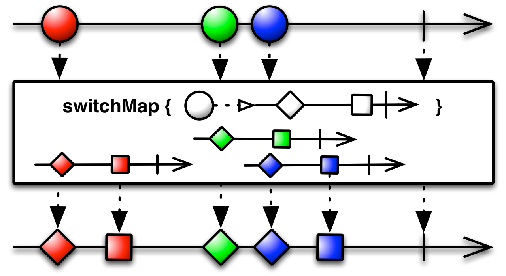

# Operator - Transforming Observables(avengers ver.)

## toArray
이름만 보면 알 수 있듯이, Array로 바꿔주는 operator같은 느낌이다.
~~~swift
     Observable.of("Iron Man", "Captain America", "Captain Marvel")
            .toArray()
            .subscribe(onNext: { (avengers) in
                print(avengers)
            })
~~~
결과는? 
**["Iron Man", "Captain America", "Captain Marvel"]**

> 주의: toArray는 데이터를 주는 Observable이 complete되지 않으면 실행이 안된다. 예제로 보자. 

~~~swift 
 var observable = PublishSubject<String>()
        
        observable
        .toArray()
        .subscribe(onNext: { (str) in
            print(str)
        })
        
        observable.onNext("Iron Man")
        observable.onNext("Captain America")
        observable.onNext("Captain Marvel")
~~~

이렇게 있을 때, ["Iron Man", "Captain America", "Captain Marvel"]이 결과로 나오면 좋을 것 같지만 아무 결과도 나오지 않는다. observable이 complete를 안했기 때문. 

~~~swift 
observable.onNext("Iron Man")
observable.onNext("Captain America")
observable.onNext("Captain Marvel")
        
observable.onCompleted()
~~~
onCompleted를 해야지만 ["Iron Man", "Captain America", "Captain Marvel"]가 출력된다.


## map

~~~swift 
Observable.just(4).map { $0 * 2 }.subscribe(onNext: { (num) in
            print(num)
        }, onCompleted: {
            print("on complete")
        })
~~~
결과: 8 "on complete"
가장 간단한 변환 오퍼레이터.
Observable이 배출한 항목에 함수를 적용한다.

## enumerated
enumerated뜻은 뭐 일일이 헤아리다..정도로 보면 된다. 이것도 마찬가지로 굳이 Rx가 아니더라도..많이 본거라..
RxSwift에서 뜻은, An observable sequence that contains tuples of source sequence elements and their indexs. 
인덱스와 그 element을 포함한 tuple 옵저버블을 리턴한다. 

~~~swift 
Observable.of("Iron Man", "Captain America", "Captain Marvel")
            .enumerated()
            .subscribe(onNext: { (avengers) in
                print(avengers)
            })
~~~

이렇게 하면,

**(index: 0, element: "Iron Man")\
(index: 1, element: "Captain America")\
(index: 2, element: "Captain Marvel")**


가 나오게 된당

## flatMap
flatMap도 하나의 map임. 데이터를 조작할 수 있다. 
하나의 Observable이 발행하는 항목들을 **여러개의 Observable로 변환**하고, 항목들의 배출을 차례차례 줄 세워 하나의 Observable로 전달한다.
```map()```은 원하는 입력값을 어떤 함수에 넣어서 변환 할 수 있는 1:1 함수이지만,
```flatMap()```은 똑같이 함수에 넣더라도 **결과가 Observable**로 나온다.


~~~swift 
Observable.just(4).flatMap { Observable.just($0 * 2) }.subscribe(onNext: { (num) in
            print(num)
        }, onCompleted: {
            print("on complete")
        })
~~~
결과: 8 "on complete"
flatMap에서 Observable로 만들어줘서 리턴해줘야함. 

## flatMapLatest(RxSwift) / switchMap(RxJava)

switchMap은 또 concatMap이랑은 다름.
concatMap()이 인터리빙이 발생 할 수 있는 상황에서 동작의 순서를 보장해준다면, switchMap()은 순서를 보장하기 위해 기존에 진행중이던 작업을 바로 중단합니다. 



즉 마지막에 들어온 데이터의 처리는 보장한다!
switchMap은 센서의 값을 얻어와서 처리하는 경우 유용하다. 센서값은 중간값보다는 최종적인 값으로 결과를 처리하는 경우가 많기 때문.

> RxSwift에서는 **flatMapLatest**라는 이름으로 있다.

## materialize


