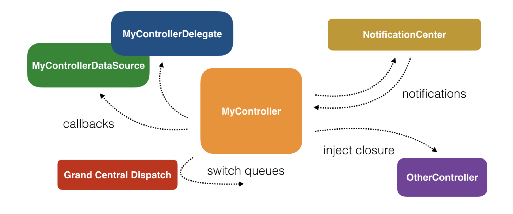
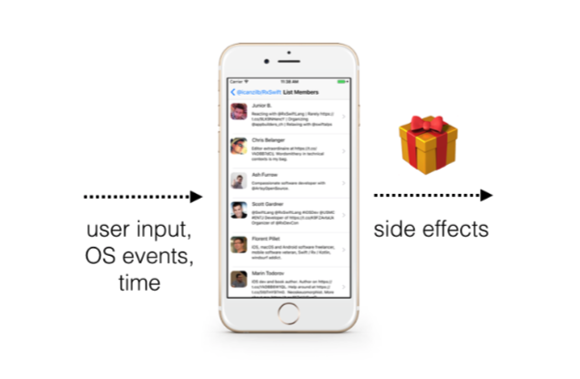

Why ReactiveX?
=======
### Cocoa and UIKit Asynchronous APIs

--------------

Apple에서는 비동기를 지원하는 다양한 API들이 있다.

- **NotificationCenter**

  키보드가 올라오거나 기기의 화면 변경과 같은 이벤트가 발생 될 때, 코드의 일부분이 **실행된다.**

- **The delegate pattern**

  임의의 시간에 API 혹은 다른 클래스에 의해 실행하기 위한 메소드를 **정의한다**. 원격 알림이 도착할 때 정의한 메소드가 실행되지만, 언제 실행 될 지 몇 번 실행 될 지 알 수는 없습니다.

- **Grand Central Dispatch**

  작업의 실행을 **추상화**하는 데 도움이 된다. 순차적으로 실행될 코드를 예약하거나 우선 순위가 다른 여러 대기열에서 동시에 많은 수의 작업을 실행할 수 있다.

- **Closure**

  클래스간에 전달할 수 있는 분리된 코드 조각을 **만들 수 있다.** 각각의 클래스에서는 이 것을 실행할지 말지, 몇 번 실행할지 결정 할 수 있습니다.

대부분의 코드들을 비동기적으로 작업을 수행하기 때문에, 모든 UI 컴포넌트들은 본질적으로 비동기다.  그래서 코드가 어떤 순서로 실행 되는지 확신할 수 없다.  앱 코드들의 대부분은 유저 입력,  네트워크 상태 혹은 OS 이벤트들과 같은 외부 요인에 의존하게 된다. 

Apple의 위에 나열 된 API들은 다른 플랫폼에 비해 뛰어나다고 할 수 있지만, 애플이 제공하는 방법이 다양하고, 이 방법들을 사용해서 여기저기에 비동기코드를 작성하면 그 뒤에 새로운 코드를 추가하기가 어렵다.

 

여기선 Delegate를 사용하고, 저기선 클로져를 쓰고, 저기선 또 NotificationCenter를 쓰고 비동기 코드가 일관성이 없어지게 된다. 비동기 코드를 아우르는 하나의 패러다임이 없기 때문에, 전체적인 비동기 코드를 이해하기 힘들어진다.

###### Synchronous code

~~~swift
var array = [1, 2, 3]
for number in array {
  print(number)
  array = [4, 5, 6]
}

print(array)
~~~

위의 for loop는 2가지를 보장한다. 

- 동기식으로 실행

- collection이 immutable하다.

###### Asynchronous code

반면에 비동기로 비슷한 코드를 짜보자. 
다음 코드는 사용자가 탭 할때 마다 다음 element를 출력하는 코드이다.

~~~swift
var array = [1, 2, 3]
var currentIndex = 0

//this method is connected in IB to a button
@IBAction func printNext(_ sender: Any) {
  print(array[currentIndex])
  if currentIndex != array.count-1 {
    currentIndex += 1
  }
}
~~~

탭을 3번 할 때, [1,2,3]이 순서대로 나온다고 보장 할 수 있는가? 그렇지 않다.  탭을 하고 있는 도중에 printNext()가 아닌 다른 곳에서 array에 접근하여 값을 변경할 수 있기 때문이다.

이와 같이 비동기 코드를 작성하면 2가지의 이슈가 있다. 

- 코드의 실행 순서가 보장되지 않는 점.
- mutable한 데이터를 공유한다는 점.

다행히도 RxSwift는 이러한 점에서 비동기 코드와 동기 코드의 장점을 가져올 수 있다.

 

### Asynchronous programming glossary

----------

RxSwift를 이해하기 위해서는 용어 정리가 먼저인듯 싶다. 

##### 1. State, and specifically, shared mutable state 

State는 정의하기가 어렵다. state를 이해하기 위해서는 아래와 같은 연습이 필요하다. 

너가 컴터를 처음 켰을 때 작동이 아주 잘됐다. 그러나 며칠 혹은 몇주 후에 이상해지기 시작했다. 하드웨어와 소프트웨어는 그대로이고 state만 변한 것이다. 재부팅을 하였더니 다시 동작이 잘되였다. 

메모리에 있는 데이터, 디스크에 있는 데이터, 사용자 입력에 반응하는 동작, 클라우드 서비스에서 데이터를 가져온 후에 남은 흔적들 모두 컴터의 state가 된다. 

당신의 app의 상태를 관리하는 것, 특히 공유되고 있는 다양한 비동기 컴포넌트들을 곧 배우게 될 것이다.

 

##### 2. Imperative Programming

명령형 프로그래밍은 프로그램의 상태를 변경하는 프로그래밍 패러다임이다. 당신의 개와 놀 떄 처럼 "가져와! 누워! 죽은척 해!"하며 명령하는 것처럼 앱에게 언제 어떻게 할 지 명령하는 것과 같다. 

모든 CPU는 간단한 명령의 긴 시퀀스를 따른다. 문제는 복잡한 비동기 코드를 명령형 코드로 짜는 부분이 어렵다. 특히 공유된 mutable한 state가 포함된다면.. 

 

##### 3. Side effects

Side effects란, 현재 스코프의 밖에서 상태의 변화가 일어난 것을 말한다. 아래의 예제를 보자

~~~swift
override func viewDidAppear(_ animated: Bool) {
  super.viewDidAppear(animated)
  setupUI()
  connectUIControls()
  createDataSource()
  listenForChanges()
}
~~~

위의 코드에서 connectUIControls()은 어떤 이벤트 핸들러를 UI Components에 연결하는 것으로 보여진다. View의 상태가 변하게 되는 것인데 이것은 side effects의 원인이 될 수 있다. 즉, 앱은 connectUIControls() 이전에 실행되던 것과 그 후에는 다르게 동작하게 된다.

언제든지 disk에 쌓여진 data를 수정하거나 스크린에 나타난 label의 text를 수정하는 것은 side effects의 원인이 될 수 있다.

오해가 있을 수 있는데 Side effects는 나쁜 것이 아니다. 결국 side effects는 어떤 프로그램이던 궁극적인 목표이다. 프로그램의 실행이 종료되면 state는 꼭 변경되어야 한다. 잠시 실행하고 아무것도 안한다면 쓸모 없는 앱이 될 것이다.

Side effects는 제어가 가능해야하는 것이 포인트다. 사이드 이펙트가 원인이 되는 코드를 간단하게 처리하여 데이터를 출력해야한다. RxSwift는 이러한 이슈를 해결하려 한다. 

 

##### 4. Declarative code

명령형 프로그래밍에서는 state가 변경 될 수 있다. 함수형 코드에서는 side effects가 발생 되지 않을 수 있다. 이 세상은 완벽하지 않기에 균형을 맞춘다는 것은 거짓말과 같다. 하지만 RxSwift는 명령형 코드와 함수형 코드의 장점들만 조합하였다.

명령형 코드는 동작을 정의할 수 있으며, RxSwift는 관련 이벤트가 동작할때마다 immutable하고 share 되지 않은 data 입력이 가능하다. 

이러한 방법으로 비동기 코드를 짤 수 있지만 위에서 다뤘던 for loop로 만들어진 동기식 코드에서 보장되는 점을 가져 올 수 있다. 즉, 변경 불가능한 데이터로 작업하고 순차적으로 코드를 실행할 수 있다.

 

##### 5. Reactive systems

Reactive system은 다소 추상적인 용어이며, 다음과 같은 특성을 얘기한다.

- Responsive : UI를 항상 최신으로 유지한다.
- Resilient : 각 동작은 독립적으로 정의되었고, 유연한 오류 처리를 제공한다.
- Elastic: 코드는 다양한 부하를 처리한다. 데이터 콜렉션을 가져오는데 오래 걸리는 부분, event throttling, 자원 공유 같은 것을 구현한다. 
- Message driven : Components들은 메세지 기반 통신을 하여 향상된 재사용과 독립성 및 lifeCycle과 구현된 클래스를 분리한다.

 