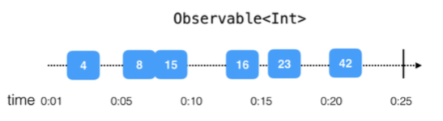
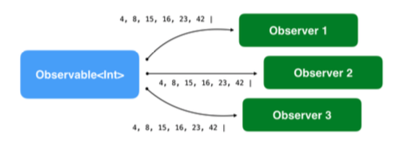

Observable
=======
### Cocoa and UIKit Asynchronous APIs

--------------

#####  1. Observable<T>

immutable한 T타입의 비동기 이벤트 시퀀스를 발생시킨다. 
Observable<T>는 한개 이상의 옵저버들이 실시간으로 어떤 이벤트에 반응하여 앱 UI를 업데이트하거나 들어오는 데이터를 처리할 수 있다. 

Observable은 다음 3가지의 이벤트만 방출한다.

- A next event : 최신/다음 데이터를 '전달'하는 이벤트. (옵저버가 값을 "받는" 방법이다.)
- A complete event : Observable 생명주기를 성공적으로 완료하며 시퀀스를 종료하는 이벤트다.
- An error event : Error를 방출하며 시퀀스를 종료한다.

아래의 그림처럼 시간 순으로 비동기 이벤트를 방출하는 Observable을 볼 수 있다. 

다음과 같이 하나의 Observable에 여러 Observer들이 구독할 수도 있다.

Observable은 Observable, Observer 자체와 연결되는 것이 아니다. **이벤트 시퀀스**를 이용하기 때문에, delegate 프로토콜을 이용할 필요도 없고, class간의 통신을 위해 클로져를 삽입 할 필요가 없다. 

 

### What is Observable??

흔히들 Observable, Observable Sequence, Sequence를 많이 들었을 것이다. 이것들은 사실 같은 의미이다.  다른 플랫폼의 리액티브 프로그래밍에서는 Stream이라고도 한다. 의미는 같지만 RxSwift에서는 시퀀스라고 부른다.

어쨌든 중요한것은 **비동기적**이라는 것이다.

Observable들은 이벤트를 생성하는데, 이것을 **Emitting**이라고 한다. 이벤트들은 숫자나 커스텀 타입의 인스턴스를 가질 수 있으며  탭과 같은 제스쳐들을 인식할 수 있다.

