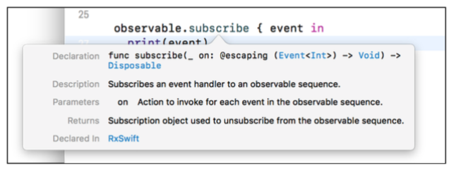

Observable
=======
#####  Observable<T>
immutable한 T타입의 비동기 이벤트 시퀀스를 발생시킨다. 
Observable<T>는 한개 이상의 옵저버들이 실시간으로 어떤 이벤트에 반응하여 앱 UI를 업데이트하거나 들어오는 데이터를 처리할 수 있다. 

Observable은 다음 3가지의 이벤트만 방출한다.

- A next event : 최신/다음 데이터를 '전달'하는 이벤트. (옵저버가 값을 "받는" 방법이다.)
- A complete event : Observable 생명주기를 성공적으로 완료하며 시퀀스를 종료하는 이벤트다.
- An error event : Error를 방출하며 시퀀스를 종료한다.

아래의 그림처럼 시간 순으로 비동기 이벤트를 방출하는 Observable을 볼 수 있다. 

다음과 같이 하나의 Observable에 여러 Observer들이 구독할 수도 있다.

Observable은 Observable, Observer 자체와 연결되는 것이 아니다. **이벤트 시퀀스**를 이용하기 때문에, delegate 프로토콜을 이용할 필요도 없고, class간의 통신을 위해 클로져를 삽입 할 필요가 없다. 

 

--------------------------

## What is Observable??

Observable이란, Observer가 구독할 수 있는 것을 말한다. Observable은 시퀀스를 통해 event를 방출한다.

흔히들 Observable, Observable Sequence, Sequence를 많이 들었을 것이다. 이것들은 사실 같은 의미이다.  다른 플랫폼의 리액티브 프로그래밍에서는 Stream이라고도 한다. 의미는 같지만 RxSwift에서는 시퀀스라고 부른다.

어쨌든 중요한것은 **비동기적**이라는 것이다.

Observable들은 이벤트를 생성하는데, 이것을 **Emitting**이라고 한다. 이벤트들은 숫자나 커스텀 타입의 인스턴스를 가질 수 있으며  탭과 같은 제스쳐들을 인식할 수 있다.

 

##### Lifecycle of an Observable

위의 그림은 Observable이 next 이벤트를 통해 각각 요소들을 방출하다가 complete 되고 있다.

반면에 Observable이 next 이벤트를 통해 각각 요소들을 방출하다가 error를 방출하고 있다. 이처럼 Observable은 error, complete 이벤트를 방출하면 시쿼스가 완전히 종료된다.

~~~swift
 /// Represents a sequence event.
 ///
 /// Sequence grammar:
 /// **next\* (error | completed)**
 public enum Event<Element> {
 	/// Next elemet is produced.
 	case next(Element)
 	
 	/// Sequence terminated with an error.
 	case error(Swift.Error)
 	
 	/// Sequence completed successfully.
 	case completed
 }
~~~

RxSwift 소스코드를 보면 알 수 있는 점은 아래와 같다

- .next는 Element 인스턴스를 가지고 있다.
- .error는 Swift.Error 인스턴스를 가진다
- .completed는 어떠한 인스턴스를 가지고 있지 않고 단순히 이벤트를 종료만 시키고 있다.

 

##### Creating observables

~~~swift
let one = 1
let two = 2
let three = 3
~~~

위와 같은 상수가 있다고 가정하자.

###### 1. just

~~~swift
let observable: Observable<Int> = Observable<Int>.just(one)
~~~

just는 하나의 element만 포함하는 sequence를 생성한다. one 하나만 방출하는 시퀀스다.

###### 2. of

~~~swift
 let observable2 : Observable<Int> = Observable.of(one, two, three)
~~~

- .of 연산자는 주어진 값들의 타입추론을 통해 sequence 생성. 
- 위 처럼 타입은 Observable<[Int]>가 아닌 Observable<Int>이다.
- array타입의 옵저버블을 만드려면 .of  연산자에 array를 넣으면 된다.

~~~swift
 let observable3 = Observable.of([one, two, three])
~~~

- 위의 타입은 Observable<[Int]>이다.
- just연산자를 쓴 것 처럼 [1,2,3]을 단일 요소로 갖게 된다.

###### 3.from

~~~swift
 let observable4 = Observable.from([one, two, three])
~~~

- observable4의 타입은 Observable<[Int]>
- from 연산자는 array요소들을 하나씩 방출한다. 
- from은 오직 array 타입만 넣을 수 있다.

 

##### Creating observables

iOS개발자라면 NotificationCenter로 통한 코드에 익숙할 것이다. 

~~~swift
let observer = NotificationCenter.default.addObserver(
  forName: .UIKeyboardDidChangeFrame,
  object: nil,
  queue: nil
) { notification in
  // Handle receiving notification
}
~~~

RxSwift는 위 처럼 구독하고 싶을때 subscribe()하면 된다. 마치 notification에서 addObserver와 같다. 가장 중요한것은 **Observable은 subscribe하기 전까지 아무런 이벤트도 방출하지 않는다. 단순히 정의만 된 상태이다.** 

 

~~~swift
let one = 1
let two = 2
let three = 3
let observable = Observable.of(one, two, three)

observable.subscribe { event in
  print(event)
}
~~~

여기서 subscribe() 하는 코드가 없다면, observable은 emit하지 못하는 상태, 즉 정의만 된 상태가 된다. 
subscribe()를 자세히 들여다 보면 아래와 같다.

Event<Int> -> Void 클로져를 파라미터로 받고 있고 Disposable을 리턴하고 있다. 

 

##### 2. empty()

empty 오퍼레이터는 위와 다르게 아무 값도 가지지 않는 옵저버블을 만든다.

~~~swift
 example(of: "empty") {
     let observable = Observable<Void>.empty()
     
     observable.subscribe(
         
         // 1
         onNext: { (element) in
             print(element)
     },
         
         // 2
         onCompleted: {
             print("Completed")
     }
     )
 }
 
 /* Prints:
  Completed
 */
~~~

Observable은 타입을 꼭 명시해줘야하는데, 타입 추론할 요소가 없기 때문이다. 해당 코드는 Complete 이벤트만 방출하게 될 것이다. empty가 쓰일 경우는 아래와 같다.

- 즉시 종료할 수 있는 Observable을 리턴하고 싶을 때
- 의도적으로 0개의 값을 가지는 Observable을 리턴하고 싶을 때

 

##### 3. never()

~~~swift
let observable = Observable<Any>.never()
     
     observable
         .subscribe(
             onNext: { (element) in
                 print(element)
         },
             onCompleted: {
                 print("Completed")
         }
     )
~~~

empty와 반대로 never는 complete조차 emit되지 않는다. 위 코드를 보면..... 아무것도 일어나지 않는다.. completed 조차.... sequence가 계속 유지 된다는건데……... 띠용? (왜쓰는거지...??)

 

##### 4. range()

~~~swift
  let observable = Observable<Int>.range(start: 1, count: 10)
  observable
    .subscribe(onNext: { i in
      let n = Double(i)
      let fibonacci = Int(((pow(1.61803, n) - pow(0.61803, n)) / 2.23606).rounded())
      print(fibonacci)
  })
~~~

이런식으로 피보나치 수열도 가능하다.

 

---------------

###  Disposing and terminating

Observabel은 **subscription**이 있을 때까지 아무것도 안한다는 것을 꼭 명심해야한다. subscription은 Observabel이 이벤트를 방출하기 위한 트리거이다. error나 complete가 방출 되어야 종료한다. 물론 Observable의 subscription을 취소할 수 있다. 

~~~swift
// 1
let observable = Observable.of("A", "B", "C")
// 2
let subscription = observable.subscribe { event in
// 3
print(event)
}
~~~

1. string을 갖는 옵저버블을 만든다.
2. 옵저버블을 구독하면, subscription 상수에 disposable이 return 된다.
3. emit된 event들이 print된다.

구독을 취소하려면 dispose()를 호출하면 된다. 그러면 옵저버블 이벤트가 발생하지 않는다.

~~~swift
subscription.dispose()
~~~

하지만 이처럼 각 subscritpion들을 따로따로 dispose()를 해주는것은 아주 귀찮은 일이다. 그럴때 우리는 **disposed(by:)** 메소드를 이용해주면 된다. 

~~~swift
// 1
let disposeBag = DisposeBag()
// 2
Observable.of("A", "B", "C")
    .subscribe { // 3
		print($0) }
    .disposed(by: disposeBag) // 4
~~~

1. dispose bag 생성
2. observable 생성
3. 옵저버블 구독 후 emit event 출력
4. subscribe로 부터 return 된 값에 disposeBag 추가

만약 위와 같이 dispose를 안한다면...?? ... 메모리 누수가 일어날 것이다.. 메모리 릭은 안돼 ~ !! 하지만 우리 swift는 dispose를 안할때마다 경고를 날려줄 것이니 우리프트만 믿고 가자

 

 

# Scheduler

개발을 하다보면 스레드들을 관리하는 일이 많다. 가령 네트워크 통신을 백그라운드 스레드에서 처리하다가 UI는 메인스레드에서 처리해야하는 일이 자주 일어난다. 스레드 관리를 유연하게 관리해야 하는 경우가 생기는데, Rx는 이러한 스레드를 관리하기 위해 scheduler가 있다. 

> _Scheduler와 스레드는 엄연히 다르다고 생각한다. scheduler는 스레드를 관리하는 친구라고 생각한다._

 

#### ObserveOn, SubscribeOn

Rx 스케줄러를 사용한다면 필수적으로 알아야 할 2가지 연산자이다.

- SubscribeOn

  -> SubscribeOn 연산자는 시퀀스가 연산을 위해 사용할 스레드를 지정하며, 아무 곳에서 호출해도 문제되지 않는다.

- ObserveOn

  -> 반면에 ObserveOn 연산자는 호출하는 시점이 중요하다. 호출 이후의 연산자들은 이 ObserveOn에 따라 스레드가 관리된다.

 

~~~swift
let backgroundScheduler = SerialDispatchQueueScheduler(globalConcurrentQueueQOS: .Default)

	[1,2,3,4,5].toObservable()
		.subscribeOn(MainScheduler.instance) 	// 1
		.doOnNext {
			UIApplication.sharedApplication().networkActivityIndicatorVisible = true
			return $0
		} 		// 2
		.observeOn(backgroundScheduler) // 3
		.flatMapLatest {
			HTTPBinDefaultAPI.sharedAPI.get($0)
		}		// 4
		.observeOn(MainScheduler.instance) 		// 5
		.subscribe {
			UIApplication.sharedApplication().networkActivityIndicatorVisible = false
			print($0)
		}		// 6
~~~

1. 시퀀스가 동작하는 스케쥴러를 메인으로 지정
2. 1에서 메인으로 지정하였기에 해당 코드는 메인에서 실행 된다.
3. 시퀀스를 백그라운드로 지정함으로 이후에 호출되는 연산자들은 백그라운드에서 실행된다.
4. HTTP 통신은 백그라운드에서 동작한다.
5. Main으로 다시 변경하여 이후에 호출되는 연산자는 메인에서 실행된다.
6. 메인에서 동작함

 

### Driver(RxCocoa)

Driver는 RxCocoa에서 지원해주고 있다. UI 작업에 좀 더 직관적으로 사용하도록 사용한다. Driver는 MainScheduler만 사용하도록 하는것인데, 데이터를 UI에 drive한다고 해서 이름을 Driver로 지었다고 한다.

 

~~~swift
var driverObserveOnScheduler: SchedulerType = MainScheduler.instance
public func asDriver(onErrorDriveWith onErrorDriveWith: Driver<E>) -> Driver<E> {
    let source = self
        .asObservable()
        .observeOn(driverObserveOnScheduler)
        .catchError { _ in
            onErrorDriveWith.asObservable()
        }
    return Driver(source)
}

public struct Driver<Element> : DriverConvertibleType {
    public typealias E = Element

    let _source: Observable<E>

    init(_ source: Observable<E>) {
        self._source = source.shareReplayLatestWhileConnected()
    }
}
~~~

Driver가 구현된 코드이다. 코드에서 보는것 처럼 Main에서 동작하도록 구현되어 있다. 또한 error도 내려주지 않는다. (빠꾸없는 친구다) 

 

##### why Driver?

~~~swift
// Using Driver	
let results = query.rx_text.asDriver()
    .throttle(0.3, scheduler: MainScheduler.instance)
    .flatMapLatest { query in
        fetchAutoCompleteItems(query)
            .asDriver(onErrorJustReturn: [])
    }

results
    .map { "\($0.count)" }
    .drive(resultCount.rx_text)
    .addDisposableTo(disposeBag)

results
    .drive(resultTableView.rx_itemsWithCellIdentifier("Cell")) { (_, result, cell) in
        cell.textLabel?.text = "\(result)"
    }
    .addDisposableTo(disposeBag)
~~~

 

~~~swift
// Using Observable	
let results = query.rx_text
    .throttle(0.3, scheduler: MainScheduler.instance)
    .flatMapLatest { query in
        fetchAutoCompleteItems(query)
            .observeOn(MainScheduler.instance)
            .catchErrorJustReturn([])
    }
    .shareReplay(1)

results
    .map { "\($0.count)" }
    .bindTo(resultCount.rx_text)
    .addDisposableTo(disposeBag)

results
    .bindTo(resultTableView.rx_itemsWithCellIdentifier("Cell")) { (_, result, cell) in
        cell.textLabel?.text = "\(result)"
    }
    .addDisposableTo(disposeBag)
~~~

Observable과 driver의 차이이다. fetchAutoCompleteItems에 driver는 main으로 알아서 지정해준다. 그리고 driver는 subscription 공유도 지원해주므로 shareReplay 연산자를 사용하지 않아도 된다.

정말 UI를 위해 태어난 친구다..!

출처 

- https://github.com/ReactiveX/RxSwift/blob/master/Documentation/Schedulers.md
- http://minsone.github.io/programming/reactive-swift-observable-vs-driver

