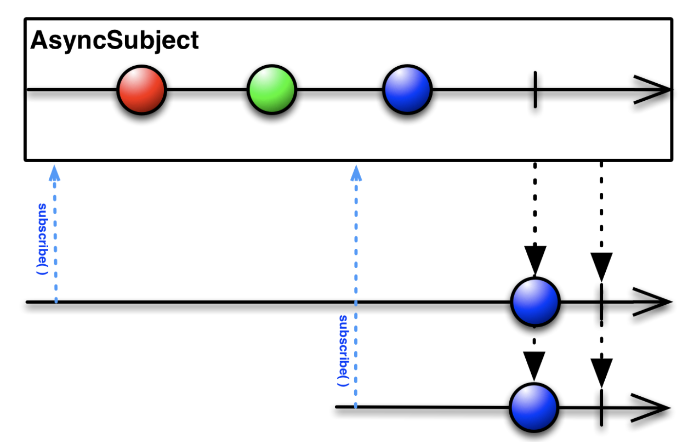
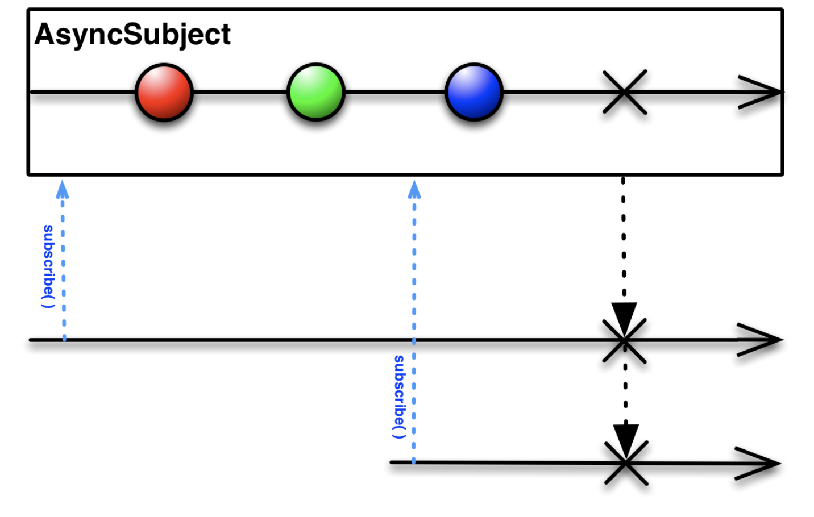
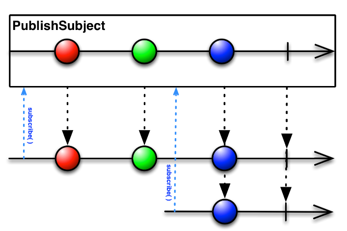
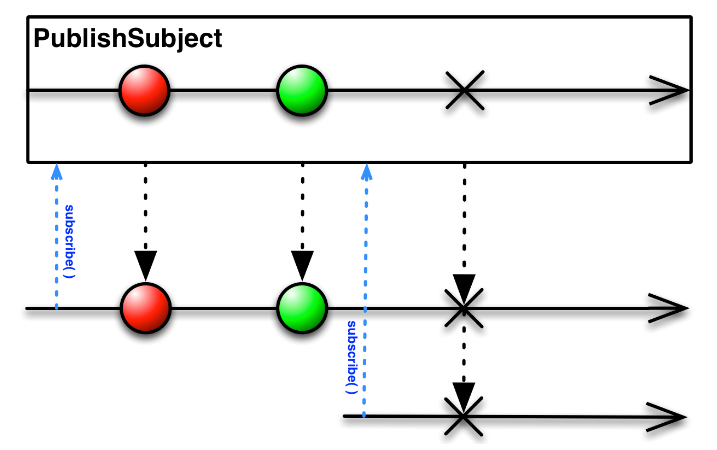
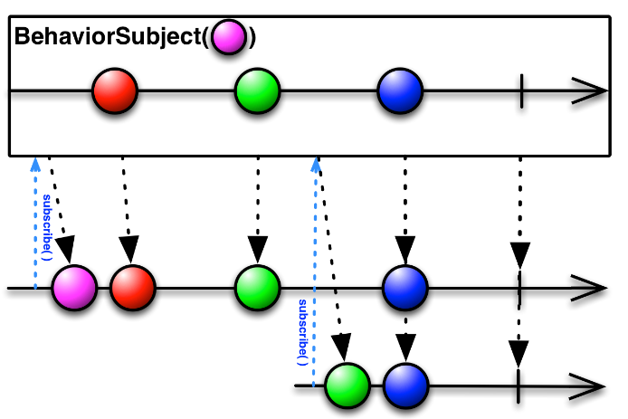
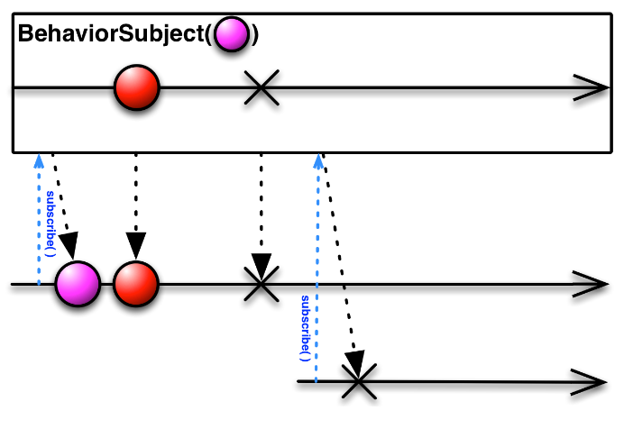
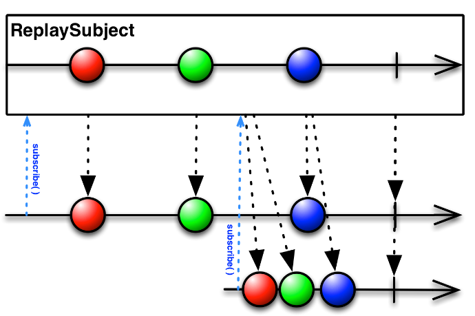
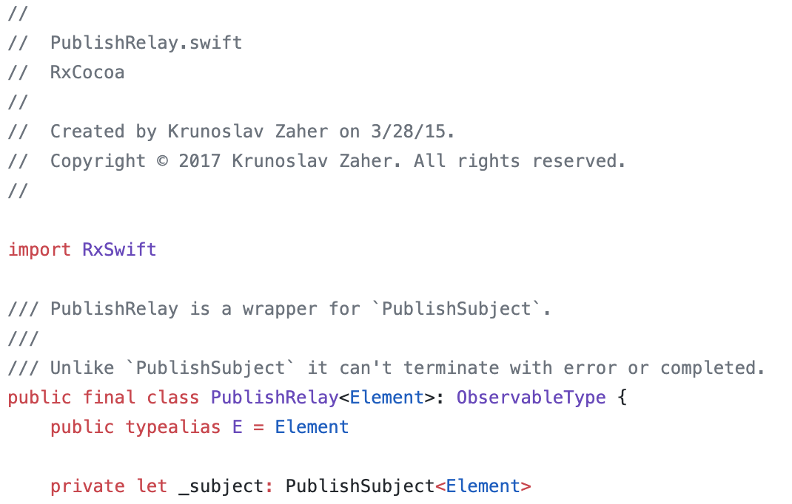
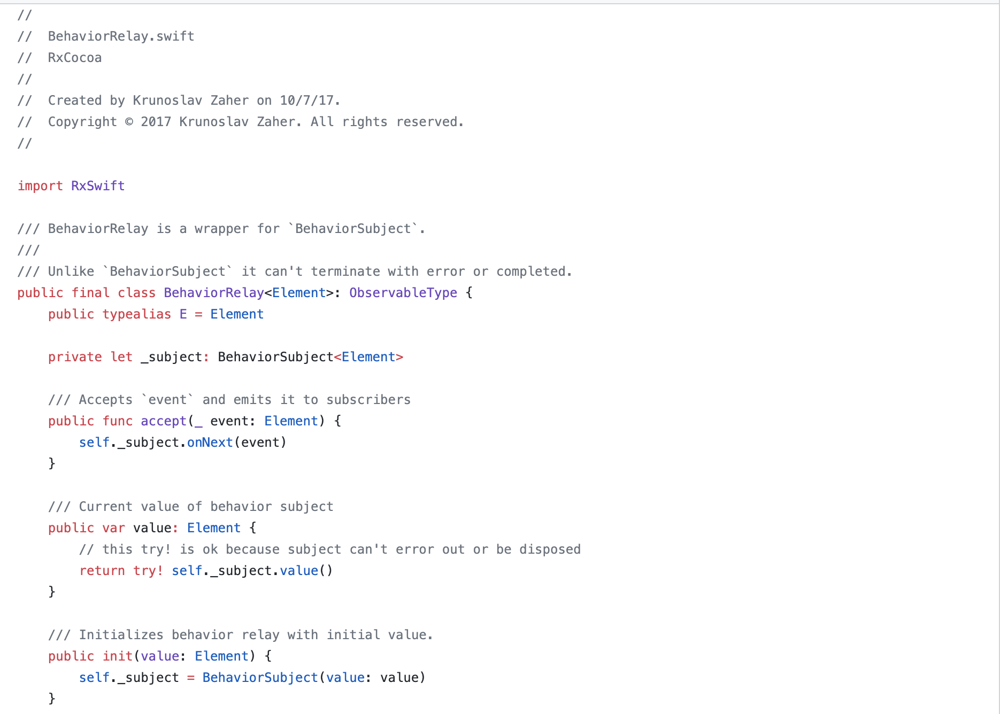

Subject
=======

Subject는 하나의 옵저버블을 구독할 수도 있고, 동시에 옵저버블이기 때문에 하나하나 재배출을 할 수도 있다.

~~~swift
//방출할 때
BehaviorSubject(value: packItem.packageName)
            .bind(to: writeVC.checkInputText)
            .disposed(by: self.disposeBag)

//구독할 때
let didTapCompleteButton = PublishSubject<Void>()
self.didTapCompleteButton
            .flatMapLatest{
				//API 통신 메소드
            }.subscribe(onNext: { _ in
                print("complete tapButton")
            })
~~~

일반적으로 Subject는 Cold Observable을 Hot Observable로 변형 해주는 효과가 있다.

> Hot Observable And Cold Observable : [링크](<https://github.com/wjdgo813/RxSwift_Practice/blob/master/RxObservable/Observable.md#hot-observable-and-cold-observable>)

### Subject 종류

##### 1) AsyncSubject

complete 될때까지 이벤트는 발생되지 않으며 complete가 되면 마지막 이벤트를 발생하고 종료된다.



만약 에러로 종료되면 마지막 이벤트 전달 없이 에러가 발생된다.



~~~swift
let asyncSubject = AsyncSubject<String>()
asyncSubject.debug().subscribe{
    print($0)
}.disposed(by:disposeBag)

asyncSubject.on(.next("1"))
asyncSubject.on(.next("2"))
asyncSubject.on(.next("3"))
asyncSubject.on(.completed)

/*
결과 
//asyncSubject()->subscribed
//asyncSubject()->Event next(3)
next(3)
//asyncSubject()->Event completed
completed
//asyncSubject()->isDisposed
*/
~~~

##### 2) PublishSubject

PublishSubject는 subscribe 된 시점 이후부터 발생한 이벤트를 전달한다. subscribe 되기 이전의 이벤트는 전달하지 않는다.



에러가 발생하면 마찬가지로 에러를 전달한다.



~~~swift
let publishSubject = PublishSubject<String>()
publishSubject.debug().subscribe{
    print("first subscribe:\($0)")
}.disposed(by:disposeBag)

publishSubject.on(.next("1"))
publishSubject.on(.next("2"))
publishSubject.debug().subscribe{
    print("second subscribe:\($0)")
}.disposed(by:disposeBag)
publishSubject.on(.next("3"))
publishSubject.on(.completed)

/** 
결과
//publishSubject()->subsribed
//publishSubject()->Event next(1)
first subscribe: next(1)
//publishSubject()->Event next(2)
first subscribe: next(2)
//publishSubject()->subscribed
//publishSubject()->Event next(3)
first subscribe: next(3)
second subscribe: next(3)
//publishSubject()->Event completed
first subscribe: completed
//publishSubject()->isDisposed
//publishSubject()->Event completed
second subscribe: completed
//publishSubject()->isDisposed
*/
~~~

##### 3) BehaviorSubject

기본적으로는 publish와 유사하지만 초기 값을 가진 subject이다. subscribe가 발생하면 즉시 현재 저장된 값을 이벤트로 전달한다. 마지막 이벤트 값을 저장하고 싶을 때 사용한다.





~~~swift
let behaviorSubject = BehaviorSubject<String>(value:"tom")
behaviorSubject.debug("behavior subject log 1").subscribe{
    print($0)
}.disposed(by:disposeBag)
behaviorSubject.on(.next("jack"))
behaviorSubject.on(.next("wade"))
behaviorSubject.debug("behavior subject log2 :").subscribe{
    print($0)
}.disposed(by:disposeBag)

/*
결과
behavior subject log 1: -> subscribed
behavior subject log 1: -> Event next(tom)
next(tom)
behavior subject log 1: -> Event next(jack)
next(jack)
behavior subject log 1: -> Event next(wade)
next(wade)
behavior subject log 2: -> subscribed
behavior subject log 2: -> Event next(wade)
next(wade)
*/
~~~

첫번째 subscribe 직후 최초 생성 시 설정한 값인 tom이 이벤트로 전달됐다. 이후 jack wade가 전달되었으며, 이후 두번째 subscribe 되자, 마지막 값인 wade가 이벤트로 전달되었다.

포인트는 마지막 이벤트의 값이 저장된다는 것이다.<br/>마지막 값이 중요하거나, 최초 subscribe시 이벤트가 바로 전달되어야 할 때 사용하면 좋다.

##### 4) ReplaySubject

n개의 이벤트를 저장하고 subscribe가 되는 시점과 상관없이 저장된 모든 이벤트를 전달한다. <br/>

RxSwift에서는 아래와 같이 2개의 생성함수가 있다.

```swift
static func create(bufferSize:Int)->ReplaySubject<Element>
static func createUnbounded()->ReplaySubject<Element>
```

createUnbounded는 subject의 생성 이후 발생하는 모든 이벤트를 저장한다.



~~~swift
let replaySubject = ReplaySubject<String>.create(bufferSize:2)
replaySubject.on(.next("tom"))
replaySubject.on(.next("jack"))
replaySubject.on(.next("wade"))
replaySubject.debug("replay subject log: ").subscribe{
    print($0)
}.disposed(by:disposeBag)
/*
replay subject log: -> subscribed
replay subject log: -> Event next(jack)
next(jack)
replay subject log: -> Event next(wade)
next(wade)
*/
~~~

이벤트는 3번 발생했지만, create(bufferSize:2) 버퍼 사이즈가 2라서 마지막 2개의 이벤트만 전달되었다.
let replaySubject = ReplaySubject<String>.createUnbounded()
로 생성헀다면 모든 이벤트가 전달 되었을 것이다.

<br/>

# Relay

RxSwift의 Subject와 다르게 Relay는 RxCocoa의 클래스다. Relay는 RxCocoa4에서 구현되었고, **PublishRelay** 와 **BehaviorRelay** 두가지가 있다. 

Relay의 특징이라 하면 onComplete, onError가 없다는 것이다. 시퀀스가 종료되기 위해서는 오직 dispose로만 가능하다. 그래서 보통 UI작업에 이용된다. (API통신하다가 에러나서 스트림이 끊기면.. 다시 시도못하니까ㅠ)

##### 1) PublishRelay



위 이미지 처럼 RxCocoa에 있는 클래스다. PublishSubject를 wrapper 해주고 있다. 즉, PublishSubject처럼 구독 이후에 값을 받을 수 있다는 것이다. 

~~~swift
let publishRelay = PublishRelay<String>()
publishRelay.accept("1")
publishRelay.accept("2")
publishRelay.subscribe { (string) in
    print(string)
}
publishRelay.accept("3")
publishRelay.accept("4")
~~~

PublishSubject에서 처럼 onNext()로 값을 방출 했다면, PublishRelay는 accecpt()를 이용하여 값을 방출한다.

##### 2) BehaviorRelay



역시 BehaviorRelay는 BehaviorSubject의 wrapper 클래스이다. PublishSubject와의 차이점이 있다면 value가 있다는 것인데, 저장된 값을 value를 통해 가져올 수 있다. (하지만 get-only-property임을 주의하자.)


<br/>

출처 : 

-https://brunch.co.kr/@tilltue/4

-https://jinshine.github.io/2019/01/05/RxSwift/3.Subject%EB%9E%80/
