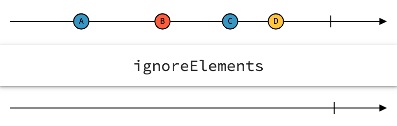
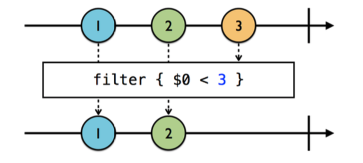

# Filtering Operators

Filtering Operators를 통해 선택적으로 .next 이벤트를 받는 것을 알아보도록 하겠다. 
Swift에서 .filter()와 비슷하다고 보면 될 것으로 보인다.

### Ignoring Operators

1. ignoreElements

위에서 보이는 것과 같이 .next이벤트는 하나도 받지 않는다. .error 혹은 .complete 이벤트 같이 종료시키는 이벤트만 받는다. 

~~~swift
let strike = PublishSubject<String>()
let disposeBag = DisposeBag()

strike
	.ignoreElements()
	.subscribe{ _ in
             print("You're out!")
            }
	.disposed(by:disposeBag)

strike.onNext("X")
strike.onNext("Y")
strike.onNext("Z")

strike.onComplete()
~~~

위의 코드는 "You're out!" 한번만 출력된다. (.onComplete만 받기 때문에)

2. elementAt()

~~~swift
let strike = PublishSubject<String>()
let disposeBag = DisposeBag()

strike.elementAt(1).subscribe(onNext:{ s in
  print("\(s)")
})

strike.onNext("X")
strike.onNext("Y")
strike.onNext("Z")
~~~

elementAt()에 들어갈 파라미터 인덱스만 onNext 이벤트를 받을 수 있다. 위의 코드는 1번째 인덱스인 "Y"만 출력 된다.

3. filter()

