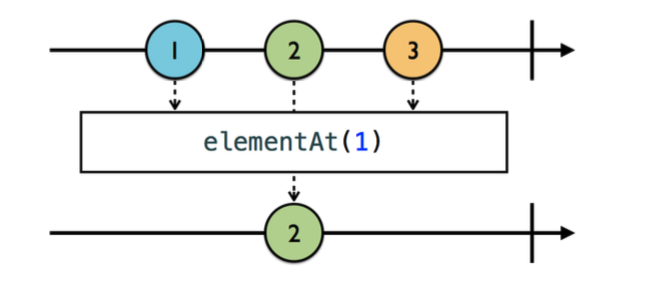
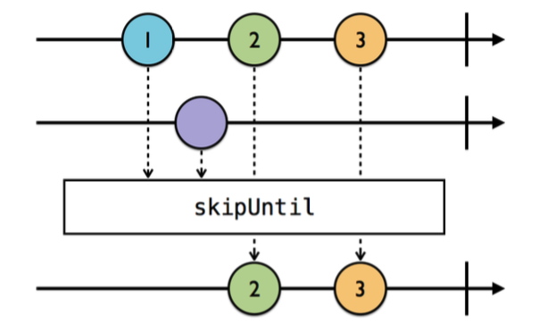

# Filtering Operators

Filtering Operators를 통해 선택적으로 .next 이벤트를 받는 것을 알아보도록 하겠다. 
Swift에서 .filter()와 비슷하다고 보면 될 것으로 보인다.

### Ignoring Operators

1. ignoreElements

위에서 보이는 것과 같이 .next이벤트는 하나도 받지 않는다. .error 혹은 .complete 이벤트 같이 종료시키는 이벤트만 받는다. 

~~~swift
let strike = PublishSubject<String>()
let disposeBag = DisposeBag()

strike
	.ignoreElements()
	.subscribe{ _ in
             print("You're out!")
            }
	.disposed(by:disposeBag)

strike.onNext("X")
strike.onNext("Y")
strike.onNext("Z")

strike.onComplete()
~~~

위의 코드는 "You're out!" 한번만 출력된다. (.onComplete만 받기 때문에)

2. elementAt()

~~~swift
let strike = PublishSubject<String>()
let disposeBag = DisposeBag()

strike.elementAt(1).subscribe(onNext:{ s in
  print("\(s)")
})

strike.onNext("X")
strike.onNext("Y")
strike.onNext("Z")
~~~

elementAt()에 들어갈 파라미터 인덱스만 onNext 이벤트를 받을 수 있다. 위의 코드는 1번째 인덱스인 "Y"만 출력 된다.

3. filter()

~~~swift
let disposeBag = DisposeBag()
Observable.of(1,2,3,4,5,6)
	.filter{  
     $0 % 2 == 0
  }.subscribe(onNext:{
    print($0)
  }).disposed(by:disposeBag)

//2,4,6 출력
~~~

### Skipping Operators

1. skip()

.skip은 n개의 요소를 스킵하는 오퍼레이터다. 

~~~swift
let disposeBag = DisposeBag()
Observable.of(1,2,3,4,5,6)
	.skip(3)
.subsribe(onNext:{
  print($0)
}).disposed(by:disposeBag)
~~~

위와 같이 skip(3)은 3개의 next이벤트를 무시한다.

2. skipWhile()

skipWhile은 filter와 반대라고 생각하면 된다. filter는 true 일 때 방출했던거와 달리 skipWhile은 **false** 일 때 방출한다.

~~~swift
 let disposeBag = DisposeBag()
  Observable.of(2, 2, 3, 4, 4)
    .skipWhile { $0 % 2 == 0 }
    .subscribe(onNext: {
      print($0)
}).disposed(by:disposeBag)
~~~

출력 값은 3,4,4 이다.

3. skipUntil()

skipUntil은 파라미터에 넘기는 Observable이 방출할 때까지 계속 skip하는 오퍼레이터다. 

~~~swift
let disposeBag = DisposeBag()

let subject = PublishSubject<String>()
let trigger = PublishSubject<String>()

subject
    .skipUntil(trigger)
    .subscribe(onNext: {
				print($0) 
    })
    .disposed(by: disposeBag)

subject.onNext("A")
subject.onNext("B")

trigger.onNext("XXXXXXXX")
subject.onNext("C")
~~~

.skipUntil에 trigger 옵저버블을 등록하였다.
trigger가 방출 되기 전까지 subject가 next 이벤트를 방출해도 skip한다.
trigger event가 방출되어야 그때서야 subject의 "C" 이벤트가 방출된다.

### Taking Operators

Taking 오퍼레이터들은 Skip 오퍼레이터와 정반대라고 생각하면 편하다.

1. take()

~~~swift
 let disposeBag = DisposeBag()
  Observable.of(1, 2, 3, 4, 5, 6)
    .take(3)
    .subscribe(onNext: {
			print($0) 
    })
    .disposed(by: disposeBag)
~~~

take는 n개까지만 이벤트를 방출 시키는 오퍼레이터다.
위 코드의 출력은 1,2,3만 된다.

2. takeWhile()

takeWhile은 true일 때만 동작을 한다. (.filter랑 다른게 뭐지..?) 

보통 RxSwift에서는 enumerated()와 함께 쓰기도 한다. Swift 표준 라이브러리에 있는 enumerated와 유사하게 Observable의 요소와 인덱스를 포함하는 튜플을 방출한다. 

~~~swift
let disposeBag = DisposeBag()
// 1
  Observable.of(2, 2, 4, 4, 6, 6)
    .enumerated()
    .takeWhile { index, integer in
      integer % 2 == 0 && index < 3
    }
    .map { $0.element }
    .subscribe(onNext: {
			print($0) 
    })
    .disposed(by: disposeBag)
~~~

takeWhile안에서 요소가 짝수인 것과 index가 3 이하인 것들만 방출하도록 하고 있다.

3. takeUntil()

takeUntil은 등록된 옵저버블이 next 이벤트를 방출하기 전까지 이벤트를 받는 것이다.

~~~swift
let disposeBag = DisposeBag()
let subject = PublishSubject<String>()
let trigger = PublishSubject<String>()

subject.takeUntil(trigger).
subscribe(onNext:{
  print($0)
}).disposed(by:disposeBag)

subject.onNext("1")
subject.onNext("2")

trigger.onNext("X")
subject.onNext("3")
~~~

trigger 옵저버블이 이벤트를 발생시키기 전까지 subject의 옵저버블은 .next를 방출시킨다.
trigger가 X 이벤트를 방출하고 난 이후로 subject 이벤트는 아무것도 방출 시키지 않는다.

아래의 코드는 takeUntil을 이용하여 disposeBag처럼 구독을 dispose하는 방법이다.

~~~swift
someObservable
    .takeUntil(self.rx.deallocated)
    .subscribe(onNext: {
			print($0) 
    })
~~~

### Distinct Operators

중복해서 **연속으로** 방출되는 것을 막아주는 오퍼레이터다.

1. distinctUntilChanged()

~~~swift
let disposeBag = DisposeBag()
     
Observable.of("A", "A", "B", "B", "A")
         .distinctUntilChanged()
         .subscribe(onNext: {
             print($0)
         })
         .disposed(by: disposeBag)
~~~

A,B,A가 출력된다.

2. distinctUntilChanged(:_)

기본적으로 distinctUntilChanged()는 같으나 중복 체크 부분을 커스텀 할 수 있다. (Equatable 프로토콜의 == 함수를 구현하는거라고 생각하면 편할 듯)

