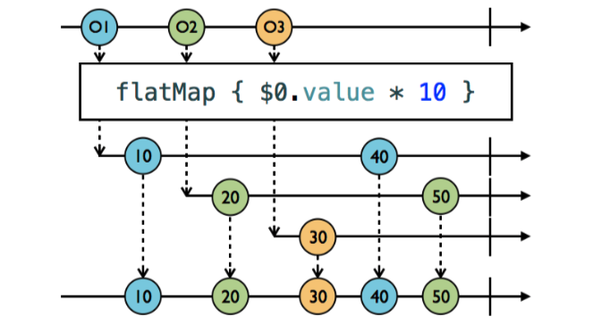
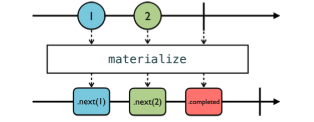
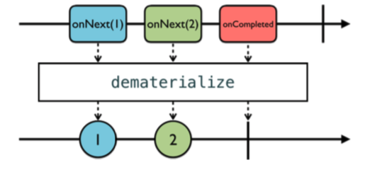

# Transforming Operators

이번 챕터는, RxSwift 오퍼레이터중에 가장 중요한 부분인 transforming 오퍼레이터에 대해 배워 볼 것이다. 

### Transforming elements

##### 1) toArray()

~~~swift
let strike = PublishSubject<String>()
let disposeBag = DisposeBag()
        
strike
	.toArray()
	.subscribe{ s in
		print("test: \(s)")
 		}
	.disposed(by:disposeBag)
        
strike.onNext("X")
strike.onNext("Y")
strike.onNext("Z")
strike.onCompleted()
~~~

next 이벤트를 array로 만들어주는 오퍼레이터다.
여기서 출력은 [X,Y,Z]로 출력된다.

##### 2) flatMap



위의 그림을 보면 \$0 = 1, \$1 = 2, \$2 = 3이고, 첫 옵저버블은 $0.value*10이 일어나고 나서 subscriber에게 10을 전달 한다. 그 이후 마블에는 복잡해서 생략되었지만, \$0은 4로 변경된다. 그 이후에 다시 40을 출력한다.

```swift
struct Student {
     var score: BehaviorSubject<Int>
 }

let disposeBag = DisposeBag()
     
let ryan = Student(score: BehaviorSubject(value: 80))
let charlotte = Student(score: BehaviorSubject(value: 90))
let student = PublishSubject<Student>()
student
	.flatMap{
		$0.score
	}
	.subscribe(onNext: {
		print($0)
	})
	.disposed(by: disposeBag)

student.onNext(ryan)    // Printed: 80
ryan.score.onNext(85)   // Printed: 80 85
student.onNext(charlotte)   // Printed: 80 85 90
ryan.score.onNext(95)   // Printed: 80 85 90 95
charlotte.score.onNext(100) // Printed: 80 85 90 95 100
```

위의 코드처럼 flatMap은 각 옵저버블의 변화를 인지할 수 있다.

##### 3)flatmapLatest

위의 flatMap에서 최신의 이벤트만 받고 싶을 때 사용하는 것이 flatMapLatest다. 
map + switchLatest = flatMapLatest라고 보면 쉬울 것이다. (switchLatest는 combining Operator에서 다뤄볼것이다.) 


\$0을 수신 후 10으로 변경 후, $1의 이벤트를 받고 \$1의 옵저버블로 변경한다. 그 후의 \$0의 이벤트가 발생되도 무시한다. 왜냐면 최신의 이벤트는 \$1이니까.. 

그 이후에도 \$1이 이벤트가 발생되고 \$2의 이벤트가 발생 되면 다시 한번 스위칭한다. 그리고 역시 \$1의 이벤트를 무시한다. 

~~~swift
     let disposeBag = DisposeBag()
     
     let ryan = Student(score: BehaviorSubject(value: 80))
     let charlotte = Student(score: BehaviorSubject(value: 90))
     
     let student = PublishSubject<Student>()
     
     student
         .flatMapLatest {
             $0.score
     }
         .subscribe(onNext: {
             print($0)
         })
         .disposed(by: disposeBag)
     
     student.onNext(ryan)
     ryan.score.onNext(85)
     
     student.onNext(charlotte)
     ryan.score.onNext(95)
     charlotte.score.onNext(100)
     
     /* Prints:
     	80 85 90 100
     */
~~~

위의 코드를 보면 ryan.score.onNext(95)의 이벤트는 무시된다. 이미 charlotte의 옵저버블로 스위칭 되었기 때문이다.

그래서 최신의 이벤트를 사용하는 특성 때문에 일반적으로 네트워크 통신에서 사용된다.

### Observing events

이벤트를 관찰하는 방법을 살펴보겠다.

~~~swift
     // 1
     enum MyError: Error {
         case anError
     }
     
     let disposeBag = DisposeBag()
     
     // 2
     let ryan = Student(score: BehaviorSubject(value: 80))
     let charlotte = Student(score: BehaviorSubject(value: 100))
     
     let student = BehaviorSubject(value: ryan)
     
     // 3
     let studentScore = student
         .flatMapLatest{
             $0.score
     }
     
     // 4
     studentScore
         .subscribe(onNext: {
             print($0)
         })
         .disposed(by: disposeBag)
     
     // 5
     ryan.score.onNext(85)
     ryan.score.onError(MyError.anError)
     ryan.score.onNext(90)
     
     // 6
     student.onNext(charlotte)
     
     /* Prints:
 		80 
 		85 
 		Unhandled error happened: anError
     */
~~~

위의 코드를 보면 error가 발생 헀을때 시퀀스가 끊기면서 다음 옵저버블의 이벤트도 받지 못하게 된다.

##### 1) materialize

materialize 오퍼레이터는 방출하는 **이벤트** 받는다.



~~~swift
let studentScore = student
         .flatMapLatest{
             $0.score.materialize()
     }
     ...
     
/* Prints:
   next(80)
 	 next(85)
 	 error(anError)
 	 next(100)
*/
~~~

studentScore의 타입은 Observable<Event<Int>>이다. 즉, 이벤트의 옵저버블인 것이다. 에러는 studentScore의 종료를 발생시키지만, student의 옵저버블은 그대로 살아 남는다. 

##### 2)dematerialize

하지만! 위는 이벤트를 받기만 할 뿐 각 이벤트의 요소를 받을 수가 없다.(이벤트만 받아서 어따 씀..)
그럴 때 사용하는 것이 dematerialize이다.



~~~swift
studentScore
  .filter {
    guard $0.error == nil else {
      print($0.error!)
			return false
		}
		return true
	}
  .dematerialize()
  .subscribe(onNext: {
		print($0) 
  })
  .disposed(by: disposeBag)
/** print
80
85
anError
100
*/
~~~

- 결과를 보면, `student` observable은 내부의 `score` observable의 에러를 통해 보호된다.
- 에러가 프린팅되며, `ryan`의 `studentScore`는 종료된다. 따라서 추가 점수는 출력되지 않는다.
- 하지만 `charlotte`를 `student`에 추가했을 때, 해당 학생의 점수는 출력된다.


