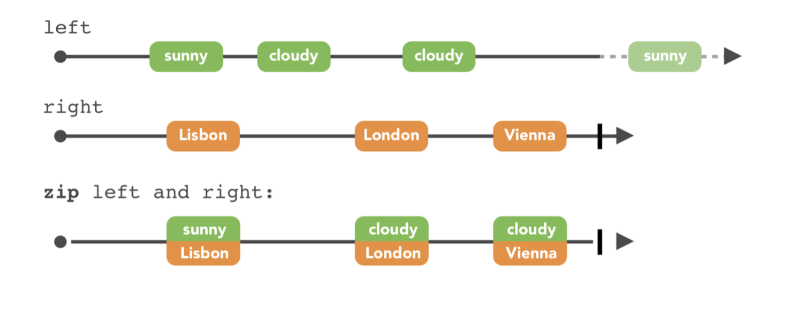
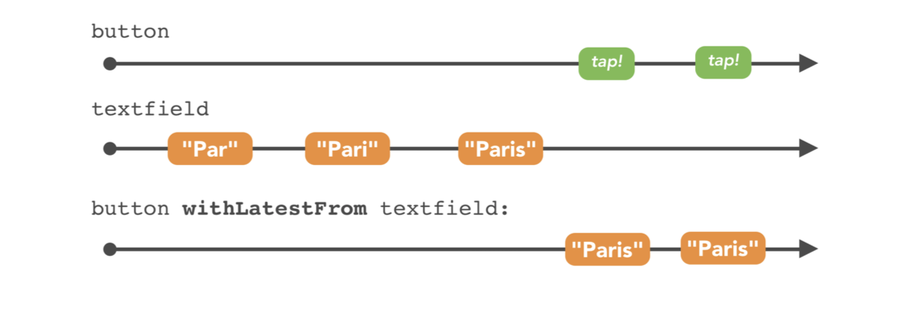
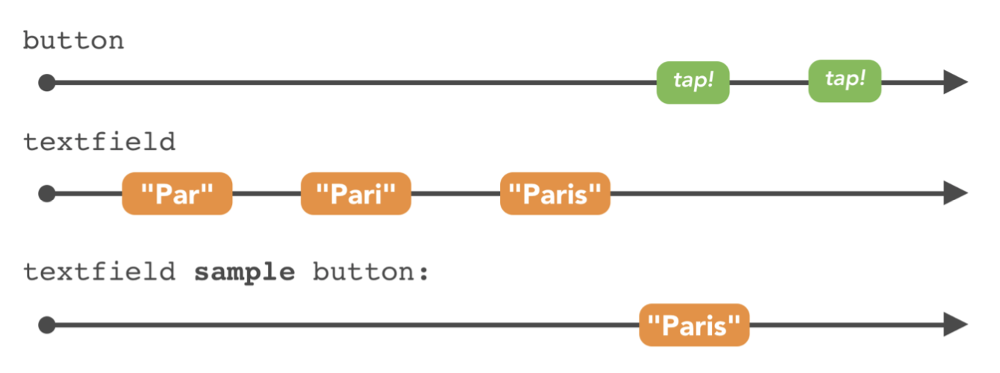
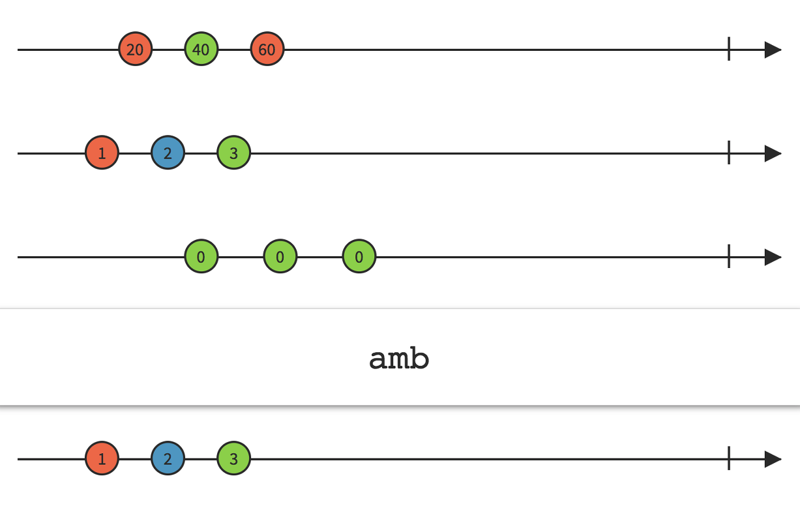
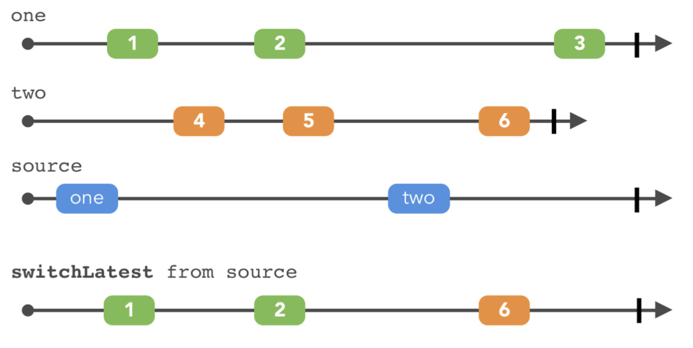
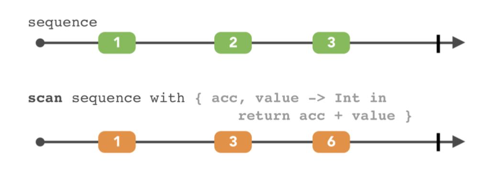

# Combining Operators(2)

### Combining elements

##### 1. zip()

지난주에 했던 CombineLatest()와 유사하지만 다른 zip()이다.

~~~swift
enum Weather{
  case cloudy
  case sunny
}

let left: Observable<Weather> = Observable.of(.sunny, .cloudy, .cloudy, .sunny)
let right = Observable.of("Lisbon", "Copenhagen", "London", "Madrid", "Vienna")

let zipObservable = Observable.zip(left, right){ weather, city in
	return "It's \(weather) in \(city)"
}

zipObservable.subscribe(onNext:{
  print($0)
})

~~~

위의 예제를 실행하면, 
Vienna는 출력되지 않는다. combineLatest()처럼 방출되고 나서 다른 옵저버가 방출될때까지 대기하는거와 달리 zip()은 양쪽이 모두 이벤트가 방출되어야 수행된다.

//결과
It's sunny in Lisbon
It's cloudy in Copenhagen
It's cloudy in London
It's sunny in Madrid

### Triggers

##### 1.withLatestFrom()

여러개의 observable을 한번에 받을 때 trigger 용도로 사용 할 수 있는 오퍼레이터다.

~~~swift
let button = PublishSubject<Void>()
let textField = PublishSubject<String>()

let observable = button.withLatestFrom(textField)
_ = observable.subscribe(onNext: { value in
    print(value)
})

textField.onNext("Par")
textField.onNext("Pari")
textField.onNext("Paris")
button.onNext(())
button.onNext(())
~~~

- Android에서는 withLatestFrom 파라미터에 2개 이상의 옵저버를 넘길 수 있다. 하지만 RxSwift는 딱 한개만 지원해주고있다. 그래서 필자는 withLatestFrom에 combineLatest 옵저버를 넣어 여러개의 옵저버를 대응하도록 한다.

~~~swift
let startDateAndCountryName = Observable.combineLatest(month, day){ 	
  ($0,$1)
}

didTap.withLatestFrom(startDateAndCountryName)
.subscribe(onNext:{
  print("\($0.0): \($0.1)")
}).disposed(by:disposeBag)
~~~

##### 2.sample()

withLatestFrom()과 비슷하게 동작하지만 다른 점은 trigger가 한번만 방출한다.

~~~swift
let button = PublishSubject<Void>()
let textField = PublishSubject<String>()

let observable = textField.sample(button)
_ = observable.subscribe(onNext: { value in
    print(value)
})

textField.onNext("Par")
textField.onNext("Pari")
textField.onNext("Paris")
button.onNext(())
button.onNext(())
~~~

withLatestFrom()을 sample()처럼 동작하게 하려면 .distinctUntilChanged를 사용하면 된다

~~~swift
 let observable = button.withLatestFrom(textField)
     _ = observable
         .distinctUntilChanged()
         .subscribe(onNext: { print($0) })
~~~

- Note: withLatestFrom은 파라미터로 observable을 받고, sample은 파라미터로 (trigger) Observable을 받는다. 이 점 꼭 유의하기를..

### Switches

##### 1.amb()

~~~swift
let playerA = Observable<Int>.interval(5,scheduler:MainScheduler.instance).map{
  "player A: \($0)"
}
let playerB = Observable<Int>.interval(2,scheduler:MainScheduler.instance).map{
  "player B: \($0)"
}
let playerC = Observable<Int>.interval(3,scheduler:MainScheduler.instance).map{
  "player C: \($0)"
}

playerA.amb(playerB).amb(playerC).subscribe(onNext:{
  print("\($0)")
}).disposed(by:disposeBag)
~~~

amb연산자는 playerA,playerB,playerC 세개의 옵저버블을 구독한다. 그리고 이 중에서 가장 먼저 방출하는것을 기다리다가 먼저 하나가 방출되면 나머지의 옵저버블들은 구독을 중단한다. 그리고 처음 작동한 옵저버블에 대해서만 요소를 방출한다.

처음에 어떤 시퀀스가 방출할지 몰라서 시작하는 것을 보고 결정하는 것이다.

##### 2.switchLatest()

Observable<String> 타입의 옵저버블에서 사용가능하다. switchLatest는 옵저버블을 스위칭하는 오퍼레이터다.

~~~swift
     let source = PublishSubject<Observable<String>>()

     let one = PublishSubject<String>()
     let two = PublishSubject<String>()
     let three = PublishSubject<String>()

     let observable = source.switchLatest()
     let disposable = observable.subscribe(onNext: { print($0) })

     source.onNext(one)
     one.onNext("Some text from sequence one")
     two.onNext("Some text from sequence two")

     source.onNext(two)
     two.onNext("More text from sequence two")
     one.onNext("and also from sequence one")

     source.onNext(three)
     two.onNext("Why don't you see me?")
     one.onNext("I'm alone, help me")
     three.onNext("Hey it's three. I win")

     source.onNext(one)
     one.onNext("Nope. It's me, one!")

     disposable.dispose()

     /* Prints:
      Some text from sequence one
      More text from sequence two
      Hey it's three. I win
      Nope. It's me, one!
      */
~~~

위의 코드를 보면, source observable로 들어온 마지막 시퀀스의 아이템만 구독하는 것을 볼 수 있다. 이 것이 switchLatest의 목적이다. 

### Combining elements within a sequence

##### 1. reduce()

Swift 표준 라이브러리의 reduce와 비슷하다.

~~~swift
let source = Observable.of(1,3,5,7,9)
source.reduce(0,accumulator:+).subscribe(onNext:{
  print("\($0)")
})
~~~

1~9까지 합 해준다. 25 방출하고 완료된다.

##### 2.scan(_:accumulator:)

~~~swift
let source = Observable.of(1,3,5,7,9)
source.scan(0, accumulator: +)
observable.subscribe(onNext:{
  print($0)
})

/*
1
4
9
16
25
*/
~~~

reduce와 비슷하지만 scan은 이전 값을 축적시키는 것이다.