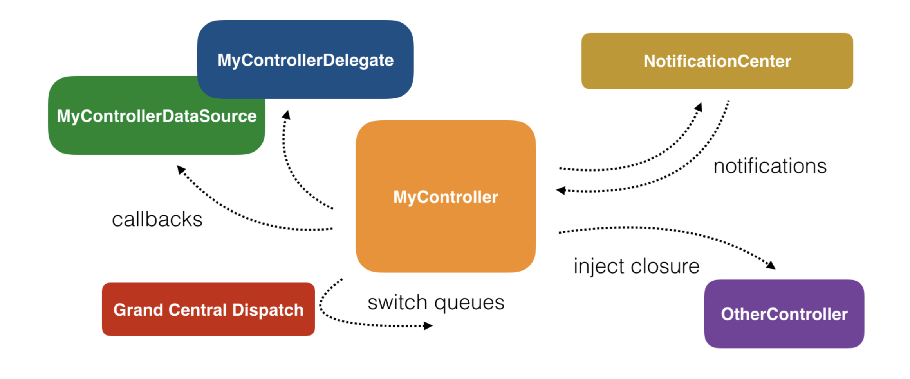

Why ReactiveX?
=======
 

### Cocoa and UIKit Asynchronous APIs

 

- **NotificationCenter**

  키보드가 올라오거나 기기의 화면 변경과 같은 이벤트가 발생 될 때, 코드의 일부분이 **실행된다.**

- **The delegate pattern**

  임의의 시간에 API 혹은 다른 클래스에 의해 실행하기 위한 메소드를 **정의한다**. 원격 알림이 도착할 때 정의한 메소드가 실행되지만, 언제 실행 될 지 몇 번 실행 될 지 알 수는 없습니다.

- **Grand Central Dispatch**

  작업의 실행을 **추상화**하는 데 도움이 된다. 순차적으로 실행될 코드를 예약하거나 우선 순위가 다른 여러 대기열에서 동시에 많은 수의 작업을 실행할 수 있다.

- **Closure**

  클래스간에 전달할 수 있는 분리된 코드 조각을 **만들 수 있다.** 각각의 클래스에서는 이 것을 실행할지 말지, 몇 번 실행할지 결정 할 수 있습니다.

대부분의 코드들을 비동기적으로 작업을 수행하기 때문에, 모든 UI 컴포넌트들은 본질적으로 비동기다.  그래서 코드가 어떤 순서로 실행 되는지 확신할 수 없다.  앱 코드들의 대부분은 유저 입력,  네트워크 상태 혹은 OS 이벤트들과 같은 외부 요인에 의존하게 된다. 

Apple의 위에 나열 된 API들은 다른 플랫폼에 비해 뛰어나다고 할 수 있지만, 애플이 제공하는 방법이 다양하고, 이 방법들을 사용해서 여기저기에 비동기코드를 작성하면 그 뒤에 새로운 코드를 추가하기가 어렵다.

 

여기선 Delegate를 사용하고, 저기선 클로져를 쓰고, 저기선 또 NotificationCenter를 쓰고.. 비동기코드 관련 코드를 아우르는 하나의 패러다임이 없기 때문에, 전체적인 비동기 코드를 이해하기 힘들어진다.

